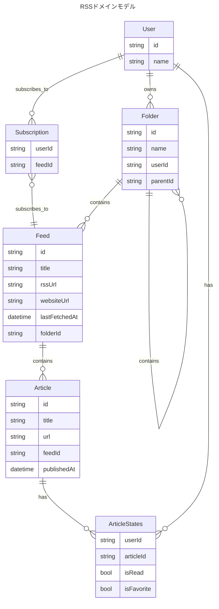

## ドメインモデル

```mermaid
---
title: RSSドメインモデル
---

erDiagram
    User {
        string id
        string name
    }
    Article {
        string id
        string title
        string url
        string feedId
        datetime publishedAt
    }
    Feed {
        string id
        string title
        string rssUrl
        string websiteUrl
        datetime lastFetchedAt
        string folderId
    }
    Subscription {
        string userId
        string feedId
    }
    Folder {
        string id
        string name
        string userId
        string parentId
    }
    ArticleStates {
        string userId
        string articleId
        bool isRead
        bool isFavorite
    }

    User ||--o{ Subscription : subscribes_to
    Subscription }o--|| Feed : subscribes_to
    Feed ||--o{ Article : contains
    User ||--o{ Folder : owns
    Folder ||--o{ Feed : contains
    User ||--o{ ArticleStates : has
    Article ||--o{ ArticleStates : has
    Folder ||--o{ Folder : contains
```
